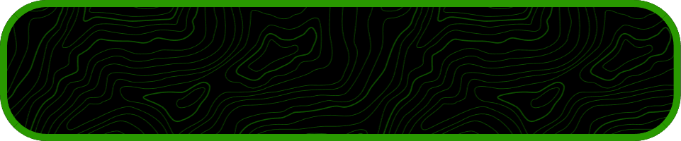

  

<h1 align="center" style="color: #ff0000;">𓆝 𓆟 𓆞 𓆝</h1>

<h6 align="center" style="color: #ff0000;">------------------------------------------------</h6>

<h5 align="center" style="color: #ff0000;">ᯓ★</h5>

  
  
  
  
  
  
  
  
  
  
  
  
  

<h2 align="center" style="color: #ff0000;">Linguagens de Programação</h2>

### Proficiente
- **Python**: Experiência sólida em desenvolvimento de scripts, automação, e projetos de software.
- **C++**: Desenvolvimento de software eficiente e criação de projetos complexos.

### Conhecimento
- **C**: Familiaridade com programação de sistemas e desenvolvimento de aplicações de baixo nível.
- **JavaScript**: Conhecimento básico em desenvolvimento web e scripts.
- **CSS**: Experiência em estilização de páginas web.
- **HTML**: Conhecimento em estruturação de páginas web.
- **Lua**: Experiência básica em scripting e desenvolvimento de jogos.

### Aprendizado Contínuo
- **Rust**: Em processo de aprendizado para explorar sistemas de baixo nível e segurança de memória.

  
  
  

